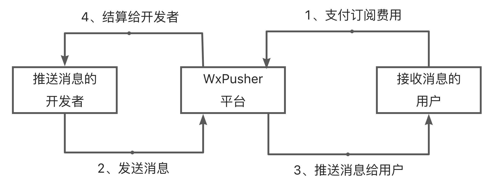

# 介绍

> 什么是WxPusher

**WxPusher** (微信推送服务)是一个使用微信公众号作为通道的，实时信息推送平台，你可以通过调用API的方式，把信息推送到微信上，无需安装额外的软件，即可做到信息实时通知。
你可以使用**WxPusher**来做服务器报警通知、抢课通知、抢票通知，信息更新提示等。
# demo演示程序
 
你可以访问演示程序，体验功能：[http://wxpusher.zjiecode.com/demo/](http://wxpusher.zjiecode.com/demo/)

演示程序源代码：[https://github.com/wxpusher/wxpusher-sdk-java/](https://github.com/wxpusher/wxpusher-sdk-java/)

**请一定不要调用demo程序，直接给用户发送消息！！！**

# 效果预览
**微信接口调整，直接发送文本消息的方式已经下线**，我们正在开发新的推送方式，敬请期待。

类型|获取用户ID|模版消息|~~普通发送~~|~~带链接的消息~~|~~长文本消息~~
:--:|:--:|:--:|:---:|:---:|:---:
预览|||||

# 名词解释
- 应用

对应你的一个项目 ，主要用来做鉴权，资源隔离等（类比使用高德地图SDK、微信登录等，都会先新建一个应用），每个应用拥有独立的名字，二维码，回调地址，调用资源，鉴权信息等，发送消息第一步，需要先新建一个应用。

简单的理解，你有一个抢火车票的项目，抢到票了需要给用户发送信息；你还有一个服务器报警的项目，服务器有异常的时候，给相关负责人发送信息，这2个的用途是不一样的，你就可以创建2个应用来分别发送他们的信息。

用户可以通过二维码或者链接关注这个应用，关注我们会把用户的UID回调给你指定的服务器，你可以通过UID给这个用户发送信息。
- 主题(Topic)

主题(Topic)是应用下面，一类消息的集合，比如创建了一个优惠相关的应用，用来给用户推送各种优惠信息，但是不同的用户关注的优惠信息不同，一部分人关注淘宝的，一部分人关注京东的。这种场景下，你就可以创建一个淘宝的主题，再创建一个京东的主题，发送信息的时候，直接发送到对应的主题即可，每个主题都有对应的订阅链接和二维码，用户订阅这个主题以后，就能接收这个主题下的信息了。

Topic只能无差别群发，不能针对用户定制消息，用户关注以后，无回调信息 。
- 应用和主题(Topic)的对比

项目|应用|主题(Topic)
:--:|:--:|:---:
概念|应用是一个独立的个体|主题属于应用，调用主题需要使用对应应用的APP_TOKEN授权
关注方式|二维码和链接|二维码和链接
发送群体|通过UID一对一发送|消息发送主题后，主题再分发给关注主题的用户，属于群发

- 各种二维码

项目|应用二维码|主题二维码
:--:|:--:|:---:
用途|用于微信用户关注应用，用户只有关注了你的应用，<br />你才能拿到他的UID，才能给他发送信息|用于订阅主题，用户订阅主题以后，你不能拿到它的UID
动静态|默认动态二维码|默认动态二维码

**动态二维码**：二维码链接不会变，但是二维码图形会变 ，因此只能使用动态二维码链接，不对截图、打印等。

**静态二维码**：二维码链接和图形都不变，可以随意使用。

- APP_TOKEN

应用的身份标志，这个只能开发者你本人知道 ，拥有APP_TOKEN，就可以给对应的应用的用户发送消息 ，所以请严格保密，不要发送到github之类的地方。
- UID
  
微信用户标志，在单独给某个用户发送消息时，来说明要发给哪个用户。

# 快速接入

## 注册并且创建应用
  
[http://wxpusher.zjiecode.com/admin/](http://wxpusher.zjiecode.com/admin/) ，使用微信扫码登录，无需注册，新用户首次扫码自动注册。

创建一个应用，如下图：


回调地址：可以不填写，不填写用户关注的时候，就不会有回调，你不能拿到用户的UID，参考<a href="#/?id=callback">回调说明</a>。

设置URL：可以不填写，填写以后，用户在微信端打开「我的订阅」，可以直接跳转到这个地址，并且会携带uid作为参数，方便做定制化页面展示。

联系方式：可以不填写，告诉用户，如何联系到你，给你反馈问题。

关注提示：用户关注或者扫应用码的时候发送给用户的提示，你可以不填写，Wxpusher会提供一个默认文案。你也可以在用户关注回调给你UID的时候，再主动推送一个提示消息给用户。

说明：描述一下，你的应用，推送的是啥内容，用户通过链接关注，或者在微信端查看的时候可以看到。

## 获取appToken
在你创建应用的过程中，你应该已经看到appToken，如果没有保存，可以通过下面的方式重制它。

打开应用的后台[http://wxpusher.zjiecode.com/admin/](http://wxpusher.zjiecode.com/admin/)，从左侧菜单栏，找到appToken菜单，在这里，你可以重置appToken，请注意，重置后，老的appToken会立即失效，调用接口会失败。


## 扫码关注应用
创建应用以后，你可以看到应用的应用码和关注链接，你可以让你的用户通过下面2种方式来关注你的应用，关注你的应用以后，你就可以给他发送消息了。


## 获取UID
目前有3种方式获取UID：
1. 关注公众号：wxpusher，然后点击「我的」-「我的UID」查询到UID；
1. 通过<a href="#/?id=create-qrcode">创建参数二维码</a>接口创建一个定制的二维码，用户扫描此二维码后，会通过<a href="#/?id=subscribe-callback">用户关注回调</a>把UID推送给你；
1. 通过<a href="#/?id=create-qrcode">创建参数二维码</a>接口创建一个定制的二维码，然后用<a href="#/?id=query-uid">查询扫码用户UID</a>接口，查询扫描此二维码的用户UID；

## 发送消息
拿到UID以后，配合应用的appToken，然后调用发送接口发送消息。

# HTTP接口说明

所有接口均已经支持https。

## 发送消息 :id=send-msg
- POST接口
  POST接口是功能完整的接口，推荐使用。

  Content-Type:application/json
  
  地址：http://wxpusher.zjiecode.com/api/send/message

  请求数据放在body里面，具体参数如下：

  ```json
  {
    "appToken":"AT_xxx",
    "content":"Wxpusher祝你中秋节快乐!",
    "summary":"消息摘要",//消息摘要，显示在微信聊天页面或者模版消息卡片上，限制长度100，可以不传，不传默认截取content前面的内容。
    "contentType":1,//内容类型 1表示文字  2表示html(只发送body标签内部的数据即可，不包括body标签) 3表示markdown 
    "topicIds":[ //发送目标的topicId，是一个数组！！！，也就是群发，使用uids单发的时候， 可以不传。
        123
    ],
    "uids":[//发送目标的UID，是一个数组。注意uids和topicIds可以同时填写，也可以只填写一个。
        "UID_xxxx"
    ],
    "url":"http://wxpusher.zjiecode.com", //原文链接，可选参数
    "verifyPay":false //是否验证订阅时间，true表示只推送给付费订阅用户，false表示推送的时候，不验证付费，不验证用户订阅到期时间，用户订阅过期了，也能收到。
}
  ```
- GET接口
  GET接口是对POST接口的阉割，主要是为了某些情况下调用方便，只支持对文字（contentType=1）的发送，举例：
  ```
  http://wxpusher.zjiecode.com/api/send/message/?appToken=AT_qHT0cTQfLwYOlBV9cJj9zDSyEmspsmyM&content=123&uid=c1BcpqxEbD8irqlGUh9BhOqR2BvH8yWZ&url=http%3a%2f%2fwxpusher.zjiecode.com
  ```
  请求参数支持：appToken、uid、topicId、content、url、verifyPay ，其中content和url请进行urlEncode编码。

## 查询状态
消息发送给Wxpusher，Wxpusher会缓存下来，后台异步推送给微信再分发给用户，当消息数量庞大的时候，可能会有延迟，你可以根据发送消息返回的messageId，查询消息的发送状态

请求方式：GET

说明：查询消息状态，消息缓存有时效性，目前设置缓存时间为7天，7天后查询消息，可能会返回消息不存在

请求地址：http://wxpusher.zjiecode.com/api/send/query/{messageId}

## 创建参数二维码 :id=create-qrcode
有一种场景，就是需要知道当前是谁扫描的二维码，比如：论坛帖子有新消息需要推送给用户，这个如果用户扫码关注，你需要知道是谁扫的二维码，把论坛用户ID和Wxpusher用户的UID绑定，当论坛用户ID有新消息时，推送给Wxpusher用户。这种场景就需要带参数的二维码。

请求方式：POST

请求地址：http://wxpusher.zjiecode.com/api/fun/create/qrcode

ContentType：application/json

说明：创建带参数二维码，用户扫码以后，会在回调里面带上参数，参考<a href="#/?id=callback">回调说明</a>

请求body:

```json
{
    "appToken":"xxx",   //必填，appToken,前面有说明，应用的标志
    "extra":"xxx",      //必填，二维码携带的参数，最长64位
    "validTime":1800    //可选，二维码的有效期，默认30分钟，最长30天，单位是秒
}
 
```

## 查询扫码用户UID :id=query-uid
用户扫描参数二维码后，设置了回调地址，我们会通过回调地址把用户的UID推送给你的服务，具体见<a href="#/?id=callback">回调说明</a>，推荐使用这种回调的方式。

但是部分用户场景简单，或者没有后端服务，比如客户端软件，使用很不方便，因此我们增加了这个查询接口，通过上面的<a href="#/?id=create-qrcode">创建参数二维码</a>接口创建一个二维码，你会拿到一个二维码的code，用此code配合这个接口，可以查询到最后一次扫描参数二维码用户的UID。

<font color="red">轮训时间间隔不能小于10秒！！禁止死循环轮训，用户退出后，必须关闭轮训，否则封号。</font>

请求方式：GET

请求地址：https://wxpusher.zjiecode.com/api/fun/scan-qrcode-uid

请求参数(Query):
 - code 创建参数二维码接口返回的code参数。

一个例子
```
https://wxpusher.zjiecode.com/api/fun/scan-qrcode-uid?code=xxxxx
```

## ~~查询用户列表V1（已弃用）~~
**本接口已经被弃用，请使用下面 查询App的关注用户V2接口**
~~你可以通过本接口，分页查询到所有关注你App的微信用户。~~

~~请求方式：GET~~

~~说明：获取到所有关注应用的微信用户用户信息~~

~~请求地址：http://wxpusher.zjiecode.com/api/fun/wxuser~~

~~请求参数：~~
 - appToken 应用密钥标志
 - page  请求数据的页码
 - pageSize 分页大小
 - uid 用户的uid，可选，如果不传就是查询所有用户，传uid就是查某个用户的信息。

~~返回数据：~~
```json
{
    "page":1, //当前数据页码
    "pageSize":50, //当前页码大小 
    "records":[
        {
            "createTime":1572755754416, //用户关注时间
            "enable":true, //是否可用，也就是用户是否开启接收消息
            "headImg":"xxxxxx",//用户头像
            "nickName":"0XFF",//用户昵称
            "uid":"xxxxxxx"//用户的UID
        }
    ],
    "total":3//所有的用户数量
}
```
## 查询用户列表V2 :id=user-list
你可以通过本接口，分页查询到所有关注应用和关注主题的用户。

请求方式：GET

说明：获取到所有关注应用/主题的微信用户用户信息。**需要注意，一个微信用户，如果同时关注应用，主题，甚至关注多个主题，会返回多条记录。**

请求地址：http://wxpusher.zjiecode.com/api/fun/wxuser/v2

请求参数：
 - appToken 应用密钥标志
 - page  请求数据的页码
 - pageSize 分页大小，不能超过100
 - uid 用户的uid，可选，如果不传就是查询所有用户，传uid就是查某个用户的信息。
 - isBlock 查询拉黑用户，可选，不传查询所有用户，true查询拉黑用户，false查询没有拉黑的用户
 - type 关注的类型，可选，不传查询所有用户，0是应用，1是主题。
返回数据：
```json
{
    "code": 1000,
    "msg": "处理成功",
    "data": {
        "total": 40,//总数
        "page": 1,//当前页码
        "pageSize": 20,//页码大小，
        "records": [
            {
                "uid": "UID_xxx",//用户uid
                "headImg": "",//新用户微信不再返回 ，强制返回空
                "createTime": 1603540859285,//创建时间
                "nickName": "",//新用户微信不再返回 ，强制返回空
                "reject": false,//是否拉黑
                "id": 47361,//id，如果调用删除或者拉黑接口，需要这个id
                "type": 0,//关注类型，0：关注应用，1：关注topic
                "target": "WxPusher官方",//关注的应用或者主题名字
                "payEndTime":0 // 0表示用户不是付费用户，大于0表示用户付费订阅到期时间，毫秒级时间戳
            }
        ]
    },
    "success": true
}
```

## 删除用户
你可以通过本接口，删除用户对应用，主题的关注。

请求方式：*DELETE*

说明：你可以删除用户对应用、主题的关注，删除以后，用户可以重新关注，如想让用户再次关注，可以调用拉黑接口，对用户拉黑。

请求地址：http://wxpusher.zjiecode.com/api/fun/remove

请求参数(Query)：
 - appToken 应用密钥标志
 - id  用户id，通过用户查询接口可以获取

返回数据：
```json
{
    "code": 1000,
    "msg": "处理成功",
    "data": "删除成功",
    "success": true
}
```

## 拉黑用户
你可以通过本接口，可以拉黑用户

请求方式：*PUT*

说明：拉黑以后不能再发送消息，用户也不能再次关注，除非你取消对他的拉黑。调用拉黑接口，不用再调用删除接口。

请求地址：http://wxpusher.zjiecode.com/api/fun/reject

请求参数(Query)：
 - appToken 应用密钥标志
 - id  用户id，通过用户查询接口可以获取
 - reject 是否拉黑，true表示拉黑，false表示取消拉黑

返回数据：
```json
{
    "code": 1000,
    "msg": "处理成功",
    "data": "删除成功",
    "success": true
}
```


# SDK调用

为了方便快速接入，各位热心的开发者贡献了很多接入SDK，[https://github.com/wxpusher/wxpusher-client](https://github.com/wxpusher/wxpusher-client).

**SDK是开发者们贡献，可能不包括最新的API或者功能，功能以本文的的HTTP接口为准，也欢迎你提PR给我们。**

# 消息产品收费

<p style="font-size:1.1em;font-weight:600">请注意，此收费是指：消息开发者，通过WxPusher向消息接收者收费，<font color="red">而不是指WxPusher向开发者或者用户收费</font>。</p>



作为开发者，<font color="red">你负责提供有价值的消息，我们负责帮你赚钱变现</font>。

接入的流程如下：

## 创建消息产品
消息产品是对单发的应用消息，群发的主题消息的包装，可以把多个消息，包装到一个消息产品下进行销售。


请注意，目前产品创建后，不支持修改，请填写清楚后再提交。

提交后，请联系客服微信「lanyunt」进行审核，付费价格策略等商谈，完成后可以上架到消息市场，用户可以直接在消息市场支付购买。

## 消息市场
说明|消息市场|消息产品列表|消息产品介绍
:--:|:--:|:--:|:--:
示例|||

## 付费信息查询

通过<a href="#/?id=user-list">查询用户列表V2</a>可以查询用户信息，其中payEndTime就是用户的订阅到期时间。

## 付费消息标记

包装为产品的应用或者主题，在发送消息的时候，可以区分本条消息是否只有付费订阅期内的用户才收得到。
根据verifyPay字段来做区别
 - verifyPay=true，表示本条消息，只发送给付费订阅期内的用户
 - verifyPay=false，表示本条消息 ，不验证付费状态，关注了应用或者主题就可以收到。

具体可以查看<a href="#/?id=send-msg">发送消息的接口</a>说明，没有包装成产品的应用或者主题，verifyPay字段无效，可以不用传递。


# 回调说明 :id=callback
当用户关注应用或者发送命令消息到公众号的时候，WxPusher会将消息推送给你。
如果你没有后台服务，也可以轮训，参考<a href="#/?id=query-uid">查询扫码用户UID</a>接口。

## 用户关注回调 :id=subscribe-callback
给用户发送消息，需要知道用户的UID，有2种途径知道用户的UID：
- 用户关注公众号以后，在菜单里面，找到「获取UID」就可以看到自己的UID了。
- 如果你在创建应用的时候，写了回调地址，当用户扫描你的应用二维码关注你创建的应用时，WxPusher会对你设置的地址发起HTTP调用，把用户的UID推送给你。
回调的使用POST方法，数据格式如下：
```json
{
    "action":"app_subscribe",//动作，app_subscribe 表示用户关注应用回调，后期可能会添加其他动作，请做好兼容。
    "data":{
        "appId":123,//创建的应用ID
        "appKey":"AK_xxxxxx", //关注应用的appKey，请不要再使用，将来可能会被删除
        "appName":"应用名字",
        "source":"scan", //用户关注渠道，scan表示扫码关注，link表示链接关注，command表示通过消息关注应用，后期可能还会添加其他渠道。
        "userName":"", //新用户微信不再返回 ，强制返回空
        "userHeadImg":"",//新用户微信不再返回 ，强制返回空
        "time":1569416451573, //消息发生时间
        "uid":"UID_xxxxxx", //用户uid
        "extra":"xxx"    //用户扫描带参数的二维码，二维码携带的参数。扫描默认二维码为空
    }
}
```

## 付费状态回调
对于消息产品，如果用户付费或者退款以后，开发者可能需要感知到用户的付费订阅状态。

因此当用户的付费订阅状态变化的时候，会通过下面的回调消息通知你，你可以在收到通知的时候，通过<a href="#/?id=user-list">查询用户列表V2</a>查询到用户的订阅到期时间等信息。

```json
{
    "action":"order_pay",//动作，表示用户付费或者退款。后期可能会添加其他动作，请做好兼容。
    "data":{
        "addTime":86400000,//付费增加的时间，毫秒。退款是负数，表示减少的订阅时间。
        "amount":50,//金额，单位分，退款是负数
        "appId":30630, //发生的应用id
        "createTime":1664118481675,//发生时间，毫秒级时间戳
        "prodId":12,//产品id
        "tradeNo":"202209252308016755383125546",//支付或者退款的交易号，和用户微信账单中的商户号对应
        "type":1,//1表示付款，2表示退款
        "uid":"UID_xxxxxxx"//发生用户的uid
    }
}
```


## 上行消息（用户发送消息回调）
目前WxPusher已经支持指令类的上行消息，用户发送指令，WxPusher会将指令消息回调给开发者。

指令的格式为：**#{appID} 内容**  ，比如给[演示程序](https://wxpusher.zjiecode.com/demo/)发送消息，可以发送：#97 测试 ，注意中间有一个空格。

如果只发送：#{appID} ，比如：#97 ，后面没有内容，表示关注appID为97的应用，**开发者不会收到回调消息**。

appID可以在管理后台，[应用管理-应用信息](https://wxpusher.zjiecode.com/admin/main/app/appInfo)-应用id 查看。

回调使用POST方法，数据格式如下：
```json
{
    "action":"send_up_cmd",//动作，send_up_cmd 表示上行消息回调，后期可能会添加其他动作，请做好兼容。
    "data":{
        "uid":"UID_xxx",//用户uid
        "appId":97, //应用id
        "appKey":null,//废弃字段
        "appName":"WxPusher演示",//应用名称
        "userName":"",//新用户微信不再返回 ，强制返回空
        "userHeadImg":"",//新用户微信不再返回 ，强制返回空
        "time":1603002697386,//发生时间
        "content":"内容" //用户发送的内容
    }
}
```


# 限制说明
WxPusher是免费的推送服务，为了能更好的服务大家，这里说明一下系统相关数据限制
- 消息发送，必须合法合规，发送违规违法欺诈等等非正常消息，可能被封号；
- WxPusher推送的是实时消息，时效性比较强，过期以后消息也就没有价值了，目前WxPusher会为你保留7天的数据 ，7天以后不再提供可靠性保证，会不定时清理历史消息；
- 单条消息的数据长度(字符数)限制是：content<40000;summary<100;url<400;
- 单条消息最大发送UID的数量<2000，单条消息最大发送topicIds的数量<5;
- 单个微信用户，也就是单个UID，每天最多接收500条消息，请合理安排发送频率。


# 迁移升级

> 新版发布以后，鼓励从老版本升级过来，因为新版本体验更好，更稳定。当然，未迁移之前，老版本是可以正常使用的。

- UID说明
  
    升级以后，UID是以**UID_**开头，新UID只能调用新接口，老ID只支持老的接口，无法交叉调用。
- 消息开关
  
    消息开关已经迁移，现在消息开关，只能控制新版本的API，老版本的消息开关，不可修改。
