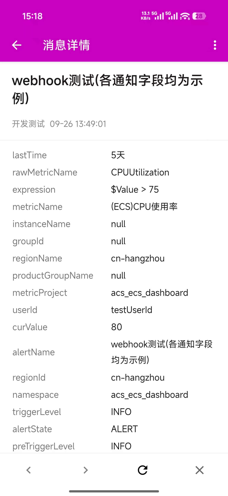
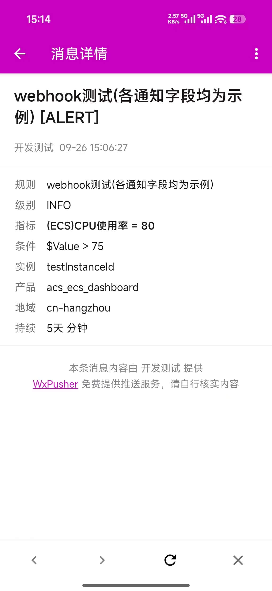
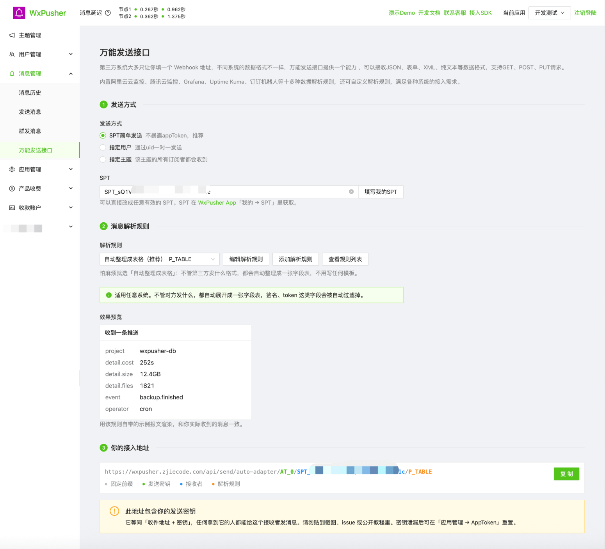
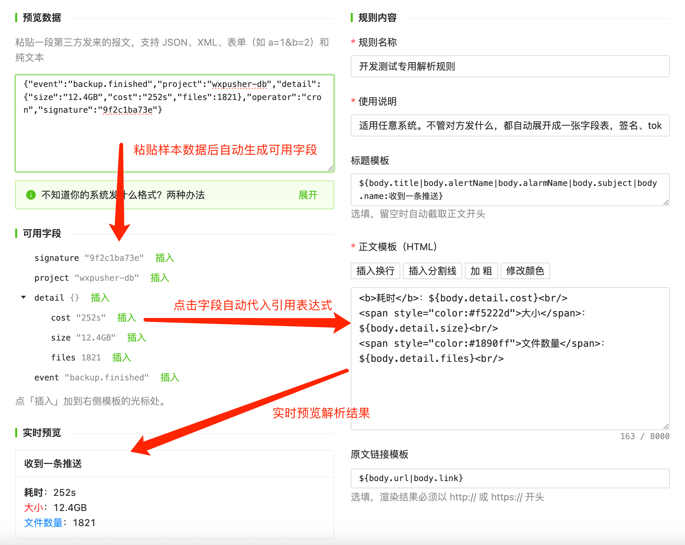

<a href="#/">← 返回 WxPusher 文档首页</a>

# WxPusher 万能消息发送接口：适配各种系统格式的消息发送回调请求Webhook

很多系统都能配置告警回调或 Webhook 通知，比如云监控、Grafana、Uptime Kuma、GitHub、CI 流水线，还有各种自建脚本。它们通常只给一个输入框，让你填一个 URL。

麻烦在于，每个系统发出来的数据格式都不一样：阿里云发表单，Grafana 发 JSON，还有系统发 XML 或纯文本。以前想把这些通知推到手机上，要么找现成的适配工具，要么自己写个中转脚本做格式转换。

现在，WxPusher 的「万能发送接口」可以直接接收这些通知：在后台生成一个地址，填到第三方系统里。对方发什么格式都能接住，整理好后推送到你的手机。

## 同一条告警，两种看法

下面是同一条阿里云云监控告警，分别用两种解析规则收到的效果。

第一张用的是「**自动整理成表格**」规则：不需要任何配置，对方发来的字段会原样整理成一张表。适用于任何系统，拿不准选什么规则时，选它就可以。

第二张用的是内置的「**阿里云云监控**」规则：标题带上了告警状态，正文只保留规则、级别、指标、条件等关键信息，一眼就能看清发生了什么。

每条消息由**标题、正文、原文链接**三部分组成。选用哪条解析规则，决定了从数据里取哪些字段、怎么排版。

## 三步生成接入地址

登录 [WxPusher 管理后台](https://wxpusher.zjiecode.com/admin/)，进入「消息管理 → 万能发送接口」。

全程可视化操作，使用非常简单。

1. **发送方式**：个人使用选「SPT 简单发送」，点「填写我的 SPT」一键填入，不需要创建应用，也不会暴露 appToken。要发给其他用户或某个主题的所有订阅者，就选「指定用户」或「指定主题」。
2. **消息解析规则**：默认是「自动整理成表格」。如果对方正好是内置支持的系统，选对应的规则效果更好。下方的效果预览就是实际收到的样子。
3. **复制地址**：粘贴到第三方系统的 Webhook 配置里，就完成了。

> 这个地址里包含你的发送密钥，拿到它的人可以向这个接收者发消息，注意不要公开。

阿里云的配置位置在「云监控 → 报警联系人 → 报警回调」。它发的是表单格式，里面还有一些非标准写法，这些都已经处理好了，填入地址就能用。

## 支持哪些格式和系统

**数据格式**：JSON、表单、XML、纯文本都能识别，GET 请求可以读取 URL 上的参数。支持 GET、POST、PUT 请求。WxPusher智能识别内容格式，可视化的编辑解析规则。

**内置规则**：

| 规则 | 适用场景 |
|---|---|
| 自动整理成表格（推荐） | 任意系统 |
| 原样发送请求体 / 发送完整请求 | 查看对方到底发了什么 |
| 阿里云云监控、腾讯云可观测 | 云监控告警回调 |
| Grafana / Alertmanager、Uptime Kuma | 监控告警、网站可用性监控 |
| GitHub Webhook | 仓库的 Push、PR、Issue 等事件 |
| 钉钉、企业微信、飞书机器人格式 | 原本推送给这些机器人的系统 |
| Server酱、Gotify、Bark、Slack 格式 | 原本推送给这些服务的脚本 |

最后两类可以这样用：如果你的脚本原来是推送给钉钉机器人、Server酱或 Bark 的，代码一行都不用改，把地址换成 WxPusher 的就行。

## 自己写解析规则

内置规则不够用时，可以点「添加解析规则」自己写，或者在已有规则的基础上「另存为」一份再改。

左边粘贴一段对方发来的数据，下方会列出所有可用字段。点字段后面的「插入」，右侧模板里就会写入对应的取值表达式。最下方会实时显示渲染效果，一边改一边看。

模板里用 `${...}` 取值，正文支持 HTML 和样式。几个常用写法：

| 写法 | 作用 |
|---|---|
| `${body.detail.cost}` | 按字段路径取值 |
| `${body.title\|body.subject}` | 依次尝试，取第一个有值的字段 |
| `${body.level:未知}` | 字段为空时显示默认值 |
| `${body.alerts[*].name}` | 取出数组里的每一项，逐行显示 |
| `${header.X-Event}`、`${query.token}` | 读取请求头和 URL 参数 |

对方数据里的内容会自动转义，脚本等不安全的内容会被过滤掉，不用担心被注入。

## 获取第三方发送内容格式

先选「原样发送请求体」规则，生成地址填进去，触发一次，手机上收到的就是对方发来的原始数据。复制下来，粘贴到规则编辑器里，有哪些字段就一目了然了。

也可以用 [webhook.site](https://webhook.site/) 生成一个临时地址，在网页上查看完整的请求，看完记得删掉。

## 开始使用

登录 [WxPusher 管理后台](https://wxpusher.zjiecode.com/admin/)，进入「消息管理 → 万能发送接口」即可使用，全程可视化编辑，使用非常简单，欢迎体验。

和其他功能一样永久免费，遇到问题欢迎反馈。
