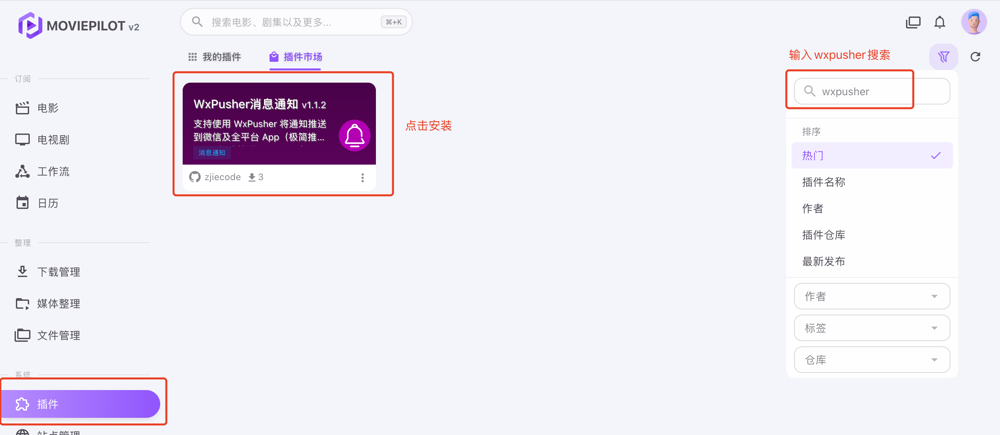
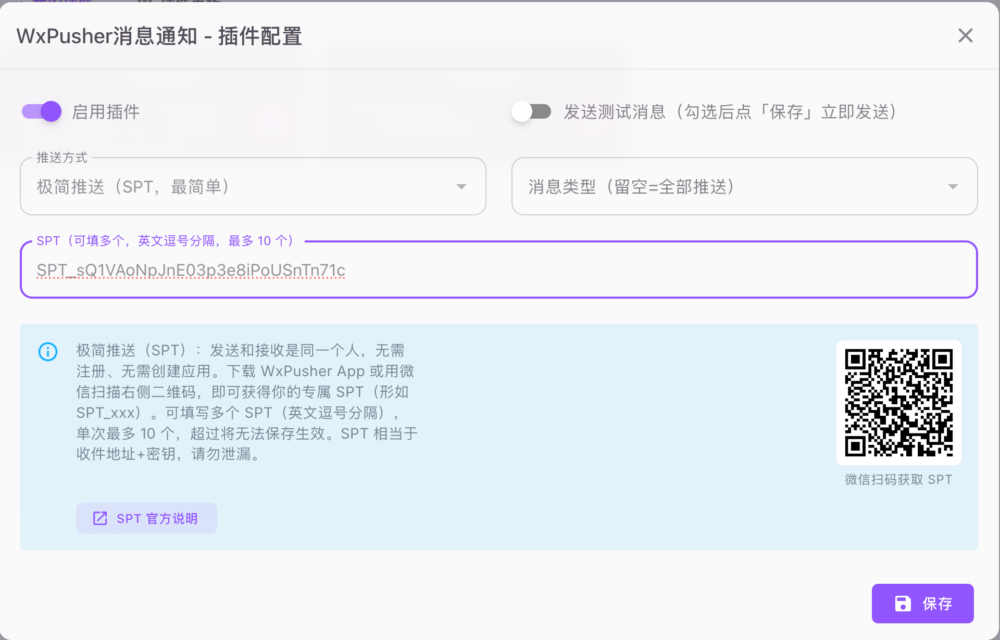
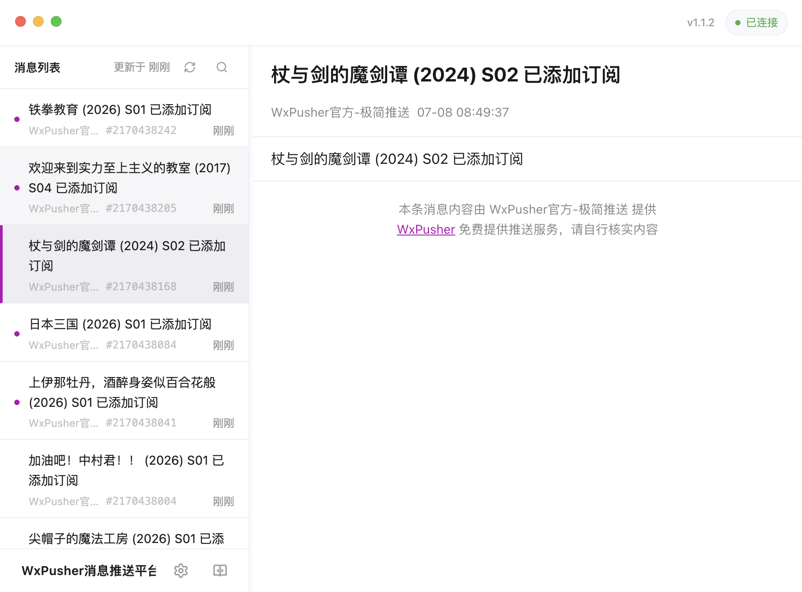
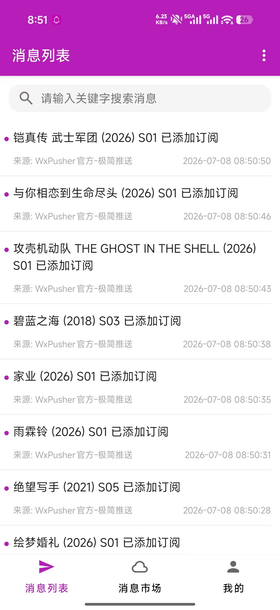
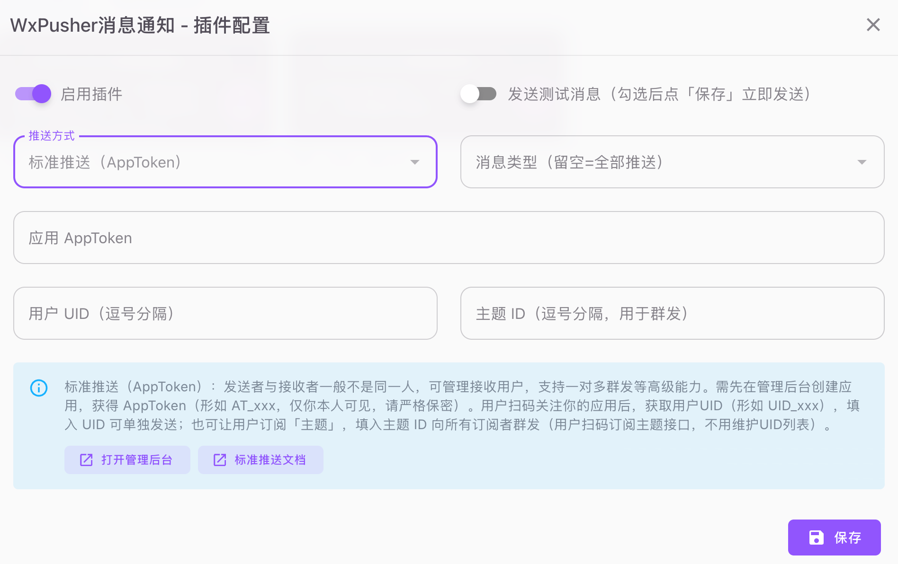

<a href="#/">← 返回 WxPusher 文档首页</a>

# MoviePilot 使用 WxPusher 推送通知教程

MoviePilot 把影视资源的订阅、搜索、下载、刮削、入库整理做成了一条自动化流水线，很适合放在 NAS 上长期跑。但自动化跑得越顺，你越需要一个可靠的通知：新剧集入库了、下载完成或失败了、订阅有更新了、磁盘或系统出异常了——这些都希望第一时间知道，而不是等打开后台才发现。

WxPusher 的极简推送刚好解决这个场景：不需要创建应用、不需要配置 appToken 和 UID，只要拿到一个 SPT（Simple Push Token），填进 MoviePilot 的 WxPusher 插件，就能把通知推送到你的微信和手机、电脑客户端。

这篇教程适合只想把 MoviePilot 的通知推给自己、或推给家里少数几个人的用户。如果你后续要做多人订阅、主题群发、用户管理等更完整的能力，可以再升级为 WxPusher 标准推送，本文最后也会讲到。

## 一、MoviePilot 是什么

[MoviePilot](https://github.com/jxxghp/MoviePilot) 是一款开源的 **NAS 媒体库自动化管理工具**，常和群晖、飞牛、Unraid 等 NAS 搭配使用，是国内 homelab / PT 圈非常活跃的项目。它把「找片—下片—整理—刮削—通知」这套流程自动化，主要能力包括：

- **自动订阅与搜索**：订阅电影、电视剧后，自动到各站点搜索资源；
- **对接下载器**：qBittorrent、Transmission 等，自动开始下载；
- **自动整理与刮削**：下载完成后自动重命名、归类、刮削海报和元数据；
- **对接媒体服务器**：Emby / Jellyfin / Plex，入库后媒体库自动更新；
- **插件生态**：内置插件市场，可通过插件扩展功能，本文的 WxPusher 插件就是其中之一。

MoviePilot 在运行过程中会产生大量通知（下载、入库、订阅、站点、系统告警等）。通过 **WxPusher 插件**，你可以用最低的成本把这些通知接到微信和 WxPusher 全平台 App。

## 二、这个插件能做什么

**WxPusher消息通知** 是一个 MoviePilot 插件，作用是：**监听 MoviePilot 的通知事件，把通知转发到 WxPusher**，再由 WxPusher 送达你的微信和各端客户端。它的特点：

- **两种推送方式**：
  - **极简推送（SPT）**：扫码即得 SPT，零注册、零配置，适合「发给我自己」，一次最多可发给 10 个人（推荐，默认）；
  - **标准推送（AppToken）**：用 AppToken + UID / 主题，支持管理接收者、一对多群发。
- **消息类型过滤**：可只推送你关心的类型（下载、入库、订阅、站点、系统告警等），留空则全部推送；
- **一键测试**：配置后可直接发送一条测试消息验证；
- **轻量无侵入**：只监听通知事件转发，不改 MoviePilot 核心，无额外第三方依赖。

WxPusher 支持 Android、iOS、鸿蒙、macOS、Windows、Linux 等客户端：手机端可以走厂商推送、APNs、鸿蒙 Push Kit，桌面端可以通过长连接接收系统通知。对 MoviePilot 这种「服务跑在 NAS 上、结果要及时看到」的场景，手机和电脑都能收消息会舒服很多。WxPusher 提供永久免费的基础推送服务，发送频率、单次接收人数和设备每日提醒等规则可能随线上策略调整，请以[官方限制说明](https://wxpusher.zjiecode.com/docs/#/?id=limit)为准。

## 三、获取你的 SPT

使用[WxPusher App（点击下载）](https://wxpusher.zjiecode.com/download/) 或者微信扫码下面的二维码，按页面提示获取自己的 SPT：


也可以直接访问二维码链接：

```text
https://wxpusher.zjiecode.com/api/qrcode/RwjGLMOPTYp35zSYQr0HxbCPrV9eU0wKVBXU1D5VVtya0cQXEJWPjqBdW3gKLifS.jpg
```

SPT 可以理解为你的极简推送收件地址。谁拿到这个值，谁就可以给你发消息，所以不要把它提交到公开仓库，也不要在截图里暴露。

## 四、在 MoviePilot 中安装插件

1. 登录 MoviePilot 后台，进入「**插件**」→「**插件市场**」。
2. 搜索 **WxPusher**，找到「**WxPusher消息通知**」，点击安装。
3. 安装完成后，回到「**我的插件**」即可看到它。



> 如果你看到多个插件，有其他热心网友开发的， 可以选择【WxPusher消息通知】，是官方开发，支持SPT推送，配置比较简单。

## 五、配置插件（极简推送 SPT）

在「我的插件」里点开「WxPusher消息通知」，按下面填写：

1. 打开「**启用插件**」。
2. **推送方式**选择「**极简推送（SPT，最简单）**」。
3. 在「**SPT**」里填入第三步获取到的 SPT。
4. **消息类型**：勾选你想接收的类型；留空表示全部推送。
5. 勾选「**发送测试消息**」，点「**保存**」，插件会立即发一条测试消息。



如果只推给自己，填一个 SPT 即可：

```text
SPT_xxxxxxxxxxxxxxxxx
```

如果要推给多个人（比如家里几个人都想收到），把多个 SPT 用英文逗号分隔，**最多 10 个**：

```text
SPT_xxx1,SPT_xxx2,SPT_xxx3
```

消息以 HTML 方式发送，标题会作为消息摘要展示，通知详情会放到消息正文里。

## 六、收到通知后可以期待什么

配置成功后，MoviePilot 的通知会进入 WxPusher 消息列表，并通过你启用的客户端渠道提醒你。

电脑收到 MoviePilot 的 WxPusher 通知：


手机收到 MoviePilot 的 WxPusher 通知：



常见用法包括：

- 订阅的剧集自动下载并入库后，第一时间收到「已入库」提醒；
- 大文件下载完成或失败时收到通知；
- 订阅有更新、站点有消息、系统出异常时及时提醒；
- 同一台 MoviePilot 通知家里多个人，每人填一个 SPT 即可。

## 七、标准推送（AppToken）—— 需要群发时再用

如果你想给一批人群发、且不想逐个维护 SPT，可以改用标准推送：

1. 微信扫码登录 [WxPusher 管理后台](https://wxpusher.zjiecode.com/admin/) 创建一个应用，得到 **AppToken**（形如 `AT_xxx`，请严格保密）。
2. 在插件里把「推送方式」切换为「**标准推送（AppToken）**」，填入 AppToken。
3. 在 [WxPusher 管理后台](https://wxpusher.zjiecode.com/admin/main/topics/list) 创建一个主题，并且扫码关注主题。
4. 在插件里填入「主题 ID」，一条消息群发给所有订阅者——**用户扫码订阅主题即可接收消息，你不需要维护 UID 列表**。



标准推送对应 WxPusher 的标准接口：

```text
https://wxpusher.zjiecode.com/api/send/message
```

## 八、极简推送和标准推送怎么选

| 场景 | 推荐方式 | 说明 |
| :--- | :--- | :--- |
| MoviePilot 通知只发给自己 | 极简推送 | 扫码拿 SPT，填入插件即可 |
| 通知家里少数几个人 | 极简推送 | 多个 SPT 用英文逗号分隔，最多 10 个 |
| 要群发给一批人 | 标准推送 | 用主题订阅，用户扫码订阅、无需维护 UID |
| 要管理接收者 / 回调 / 更完整能力 | 标准推送 | 使用应用、UID、主题、回调等能力 |

极简推送不是标准推送的替代品，它更像一个快速入口：先让消息稳定到达，后面再按需要升级。

## 九、常见问题


### 1. SPT 可以给几个人用？

极简推送单次最多 **10 个** SPT。多个 SPT 使用英文逗号分隔，不要使用中文逗号；超过 10 个插件将无法保存生效。

### 2. 为什么测试没有收到通知？

可以按下面顺序排查：

1. SPT 是否复制完整，前后是否有空格；
2. 多个 SPT 是否使用了英文逗号；
3. MoviePilot 所在设备是否能访问 `wxpusher.zjiecode.com`；
4. WxPusher 客户端是否已登录，并开启了对应系统的通知权限；
5. 「消息类型」是否勾选过窄，把测试消息类型过滤掉了。

### 3. 会不会和 MoviePilot 内置的通知渠道冲突？

不会。这个插件是并行工作的：MoviePilot 每发一条通知，都会广播一个通知事件，插件监听到后转发给 WxPusher。它**不依赖也不占用**「设定 → 通知」里的内置渠道，即使你一个内置渠道都没配，插件照样能推送。

### 4. 每次增加用户都需要修改配置，有其他方式吗？

有，切换到标准推送，用主题（Topic）的方式推送，配置发送到主题以后，后续增加接收人员，只需要关注主题即可，无需修改配置。

## 参考资料

- [MoviePilot 项目主页](https://github.com/jxxghp/MoviePilot)
- [MoviePilot 插件开发文档](https://github.com/jxxghp/MoviePilot-Plugins)
- [WxPusher 官方文档：极简推送](https://wxpusher.zjiecode.com/docs/#/?id=spt)
- [WxPusher 官方文档：方式一（标准推送）](https://wxpusher.zjiecode.com/docs/#/?id=standard)
- [WxPusher 全平台客户端下载](https://wxpusher.zjiecode.com/download/)
