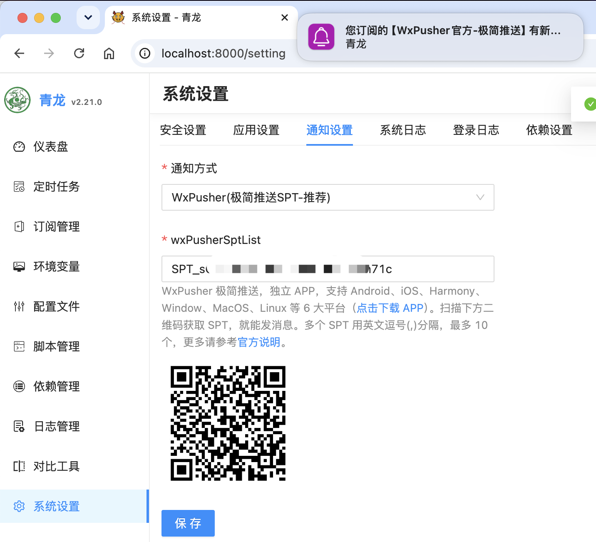
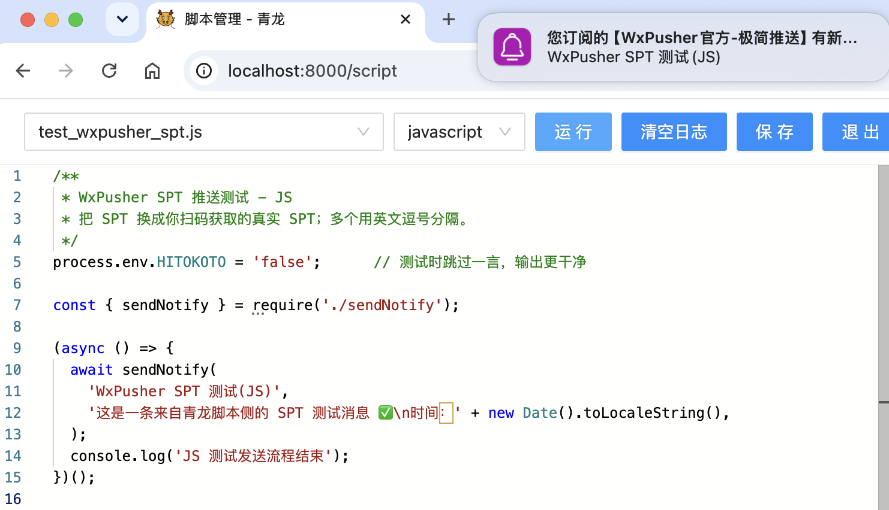
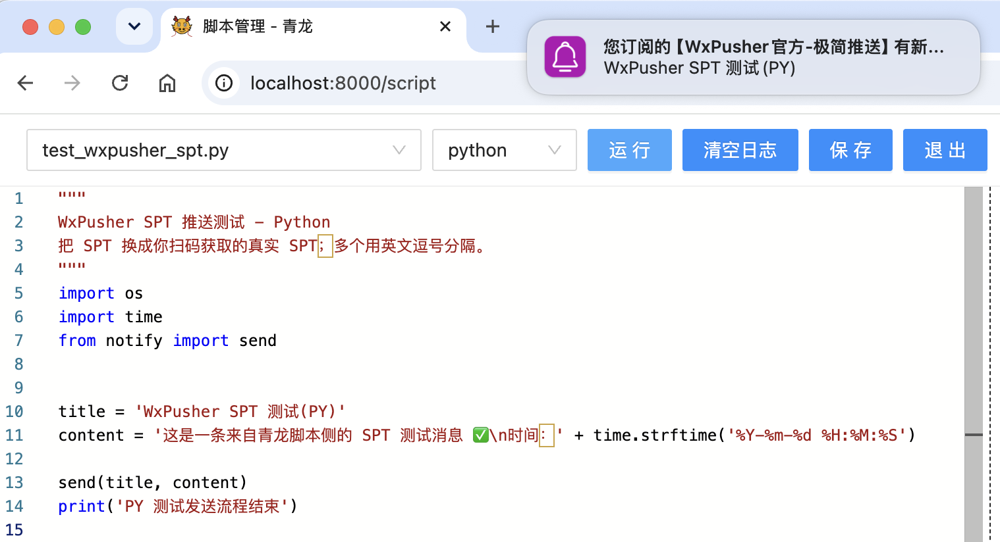

<a href="#/">← 返回 WxPusher 文档首页</a>

# 青龙面板使用 WxPusher 极简推送教程

青龙面板很适合跑定时脚本：签到、数据同步、服务巡检、自动化任务，一旦脚本失败或产出关键结果，最怕的不是报错，而是报错以后没人知道。

WxPusher 的极简推送刚好解决这个场景：不需要创建应用、不需要配置 appToken 和 UID，只要拿到一个 SPT（Simple Push Token），填进青龙面板，就可以把任务通知推送到手机和电脑。

这篇教程适合只想把青龙运行结果推给自己，或者推给少数几个人的用户。如果你后续要做多人订阅、主题群发、用户管理、回调、付费消息等更完整的消息能力，可以再升级为 WxPusher 标准推送。

## 一、先确认青龙版本

青龙面板从 [v2.21.0](https://github.com/whyour/qinglong/pull/3023) 开始支持 WxPusher 极简推送。请先确认当前版本为 `v2.21.0` 或更高版本。

需要注意，`v2.21.0` 之前的青龙版本也支持 WxPusher，只是使用的是标准推送，需要配置 appToken、UID 等信息。暂时不方便升级的用户，可以参考 [WxPusher 官方文档：方式一（标准推送）](https://wxpusher.zjiecode.com/docs/#/?id=standard) 完成接入。

进入青龙面板的通知设置，如果能看到：

```text
WxPusher(极简推送SPT-推荐)
```

就说明当前版本已经支持极简推送。如果没有这个选项，可以将青龙更新到 `v2.21.0` 或更高版本；暂时不升级，也可以继续使用上面的标准推送方式。

青龙面板本身支持 Python3、JavaScript、Shell、Typescript 脚本任务，也支持系统级通知。WxPusher 接入后，青龙任务完成、失败、告警等通知就可以通过 WxPusher 直接到达你的设备。

## 二、获取你的 SPT

打开或扫码下面的二维码，按页面提示获取自己的 SPT：


也可以直接访问二维码链接：

```text
https://wxpusher.zjiecode.com/api/qrcode/RwjGLMOPTYp35zSYQr0HxbCPrV9eU0wKVBXU1D5VVtya0cQXEJWPjqBdW3gKLifS.jpg
```

SPT 可以理解为你的极简推送收件地址。谁拿到这个值，谁就可以给你发消息，所以不要把它提交到公开仓库，也不要在截图里暴露。

WxPusher 支持 Android、iOS、鸿蒙、macOS、Windows、Linux 等客户端，手机端可以走厂商推送、APNs、鸿蒙 Push Kit，桌面端可以通过 WebSocket 长连接接收系统通知。对青龙这种“任务跑在服务器，结果要及时看到”的场景来说，手机和电脑都能收消息会舒服很多。

## 三、在青龙面板里配置

1. 登录青龙面板。
2. 进入「系统设置」里的通知配置页面。
3. 通知方式选择 `WxPusher(极简推送SPT-推荐)`。
4. 在 `wxPusherSptList` 中填入刚才获取到的 SPT。
5. 保存配置，然后点击测试通知进行验证。

配置完成后的界面如下。确认通知方式和 `wxPusherSptList` 都填写正确后再保存，图中的 SPT 已做脱敏处理：



如果只推给自己，填一个 SPT 即可：

```text
SPT_xxxxxxxxxxxxxxxxx
```

如果要推给多个人，把多个 SPT 用英文逗号分隔，最多 10 个：

```text
SPT_xxx1,SPT_xxx2,SPT_xxx3
```

青龙会自动判断：只有一个 SPT 时使用 `spt` 字段，多个 SPT 时使用 `sptList` 数组，最终调用 WxPusher 的极简推送接口：

```text
https://wxpusher.zjiecode.com/api/send/message/simple-push
```

通知内容会以 HTML 方式发送，标题会作为消息摘要展示，任务详情会放到消息正文里。对于青龙自身触发的系统通知，你不需要额外编写接口代码。

## 四、通过配置文件或环境变量配置

如果需要让「脚本管理」中的 JavaScript 或 Python 脚本调用青龙通知模块主动发送消息，必须配置 `WXPUSHER_SPT_LIST` 环境变量。通过配置文件设置时，可以写入：

```sh
export WXPUSHER_SPT_LIST="SPT_xxxxxxxxxxxxxxxxx"
```

多个接收人同样使用英文逗号分隔：

```sh
export WXPUSHER_SPT_LIST="SPT_xxx1,SPT_xxx2"
```

如果只想使用极简推送，建议不要同时配置 `WXPUSHER_APP_TOKEN`、`WXPUSHER_TOPIC_IDS`、`WXPUSHER_UIDS`，避免标准推送和极简推送同时生效，造成重复通知。

### 运行脚本验证

完成 `WXPUSHER_SPT_LIST` 环境变量配置后，可以在「脚本管理」中运行一个会调用青龙通知模块的脚本。JavaScript 脚本调用 `sendNotify(...)` 后，青龙会读取环境变量中的 SPT 并发送通知：



Python 脚本调用 `notify.send(...)` 也会读取同一个环境变量：



截图右上角出现 WxPusher 系统通知，说明环境变量、脚本调用和客户端接收链路都已经正常工作。

## 五、收到通知后可以期待什么

配置成功后，青龙脚本的通知会进入 WxPusher 消息列表，并通过你启用的客户端渠道提醒你。

常见用法包括：

- 定时任务失败时第一时间收到错误摘要；
- 每日签到、库存监控、价格监控等脚本执行后收到结果；
- 服务器资源、脚本订阅、自动化流程异常时及时提醒；
- 同一个青龙实例通知多个维护者，每人填一个 SPT 即可。

对于个人或小团队来说，极简推送的好处是概念少：不用先理解应用、主题、UID、回调这些完整推送模型，先把消息稳定收到。等你的脚本通知从“发给自己”变成“发给一组用户”，再切换到标准推送会更自然。

## 六、极简推送和标准推送怎么选

| 场景 | 推荐方式 | 说明 |
| :--- | :--- | :--- |
| 青龙任务通知只发给自己 | 极简推送 | 扫码拿 SPT，填入青龙即可 |
| 通知少数几个维护者 | 极简推送 | 多个 SPT 用英文逗号分隔，最多 10 个 |
| 要管理大量用户 | 标准推送 | 使用应用、UID、主题等能力 |
| 要做订阅、回调、用户绑定 | 标准推送 | 支持更完整的业务闭环 |
| 要做消息产品或付费订阅 | 标准推送 | 可结合 WxPusher 消息产品能力 |

极简推送不是标准推送的替代品，它更像一个快速入口：先让消息到达，后面再按业务复杂度升级。

## 七、常见问题

### 1. 青龙通知方式里没有 WxPusher 极简推送怎么办？

先确认青龙版本。WxPusher 极简推送从 [v2.21.0](https://github.com/whyour/qinglong/commit/23a1835ffe07a2ef86e3056f8aca230867cc41e6) 开始支持，如果你的镜像或代码版本较旧，通知方式下拉框里可能还没有这个选项。你可以升级到 `v2.21.0` 或更高版本，也可以继续使用旧版本已经支持的 [方式一（标准推送）](https://wxpusher.zjiecode.com/docs/#/?id=standard)。

### 2. SPT 可以给几个人用？

青龙接入和 WxPusher 极简推送接口都按最多 10 个 SPT 处理。多个 SPT 使用英文逗号分隔，不要使用中文逗号。

### 3. 为什么测试没有收到？

可以按下面顺序排查：

1. SPT 是否复制完整，前后是否有空格；
2. 多个 SPT 是否使用英文逗号；
3. 青龙所在服务器是否能访问 `wxpusher.zjiecode.com`；
4. WxPusher 客户端是否登录，并开启了对应系统的通知权限；
5. 是否同时配置了其他通知方式，导致你看错了测试结果。

### 4. 极简推送能不能管理用户或做回调？

不能。极简推送主打“自己给自己发”或者“小范围维护者通知”。如果需要用户关注、UID 回调、主题群发、订阅关系、消息产品等能力，请使用 WxPusher 标准推送。

### 5. 青龙原来的 WxPusher 配置还能用吗？

可以。原来的 `WXPUSHER_APP_TOKEN`、`WXPUSHER_TOPIC_IDS`、`WXPUSHER_UIDS` 属于标准推送方式，适合更完整的用户管理和群发场景。极简推送只需要 `WXPUSHER_SPT_LIST`，适合快速接入。两种方式建议二选一配置，避免重复通知。

## 参考资料

- [青龙 v2.21.0：支持 WxPusher 极简推送](https://github.com/whyour/qinglong/commit/23a1835ffe07a2ef86e3056f8aca230867cc41e6)
- [WxPusher 官方文档：方式一（标准推送）](https://wxpusher.zjiecode.com/docs/#/?id=standard)
- [WxPusher 官方文档：极简推送](https://wxpusher.zjiecode.com/docs/#/?id=spt)
- [WxPusher 全平台客户端下载](https://wxpusher.zjiecode.com/download/)
- [青龙官方文档](https://qinglong.online/guide/introduction)
