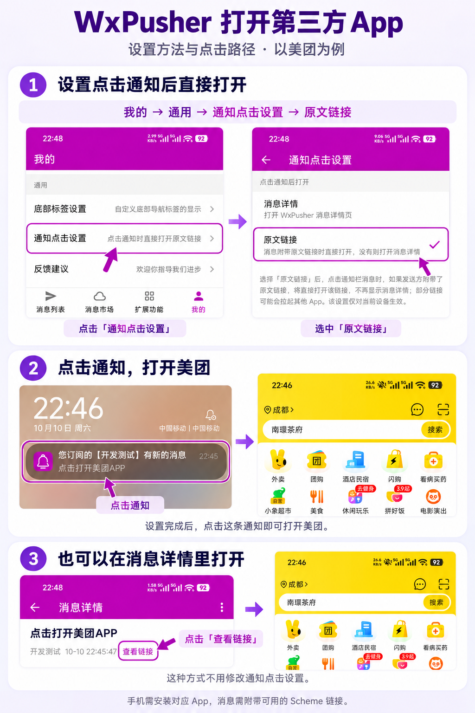

# WxPusher 支持点击通知打开第三方 App

WxPusher 的 Android、iOS、鸿蒙 App 都支持自定义 URL Scheme。发送消息时带上对应的链接，就可以从 WxPusher 打开淘宝、京东、拼多多等第三方 App。

**限时抢购、商品补货、领券时，这个功能尤其好用。** 收到提醒后，点一下通知就能进入对应的商品或活动页，省去打开 App、搜索商品、查找入口的步骤。

抢购时，几秒钟就可能错过机会。把这些操作简化成一次点击，能更快进入抢购页面，有助于提高抢购成功率。

自己的 App 如果支持 Scheme，也可以用来打开工单、审批等页面。

要这样使用，需要先在 WxPusher 里设置，让通知点击后打开「原文链接」。下面介绍具体用法。

下图以美团为例，说明设置方法和两种打开方式。



## 什么是 URL Scheme？

它是一种打开 App 的链接。例如 `yourapp://item?id=123456`，可以用来打开某个 App 的商品页。

这里的地址只是示例。实际使用时，要换成对应 App 支持的链接。手机上需要装好这个 App，同一条链接在 Android、iOS、鸿蒙上也可能有区别，先测试能否打开。

## 怎么打开？

默认情况下，点击通知会打开 WxPusher 的消息详情，再点「查看链接」就可以打开第三方 App。也可以直接点消息列表里的链接图标，这种方式不用改设置。

如果想点击通知后直接打开链接，进入：

**我的 → 通用 → 通知点击设置**，选择 **「原文链接」**。

选好后会自动保存，只对当前手机生效。想改回来，选「消息详情」即可。

设置后，点击通知时：

- 自定义 Scheme 链接交给系统打开对应的 App。
- `http://`、`https://` 链接在 WxPusher 内打开网页。
- 没有链接、链接格式不支持，或系统无法打开对应的 App 时，打开消息详情。

这个设置只影响点击通知。在消息列表点消息本身，仍然打开详情页。

## 发送时怎么填？

把 Scheme 链接填到 **`url`（原文链接）** 字段即可，其他参数照常填写。

在后台发送时，填到「URL」；在 App 发送时，展开「高级设置」，填到「原文链接」。下图以打开美团为例，表单中无关的部分已省略。


通过接口发送时，标准推送和极简推送的 POST 接口都支持。

标准推送示例：

```bash
curl -X POST 'https://wxpusher.zjiecode.com/api/send/message' \
  -H 'Content-Type: application/json' \
  -d '{
    "appToken": "AT_xxx",
    "content": "你关注的商品已补货，点击链接查看商品详情。",
    "summary": "商品补货提醒",
    "contentType": 1,
    "uids": ["UID_xxx"],
    "url": "yourapp://item?id=123456"
  }'
```

极简推送向 `https://wxpusher.zjiecode.com/api/send/message/simple-push` 发送 POST 请求：

```json
{
  "spt": "SPT_xxx",
  "content": "你关注的商品已补货，点击链接查看商品详情。",
  "summary": "商品补货提醒",
  "contentType": 1,
  "url": "yourapp://item?id=123456"
}
```

发送前，换成自己的 appToken、UID 或 SPT，以及实际可用的 Scheme 链接。`contentType` 按正文格式填写，不影响链接怎么打开。

## 几点说明

- 点击通知直接打开链接，需要接收者自己设置，发送方不能强制开启。
- `url` 最长 1000 个字符，尽量简短。部分推送通道可能放不下长链接，这时点击通知仍会打开详情。
- 打开第三方 App 后，是否需要登录、能否进入指定页面，由第三方 App 处理。
- 直接打开原文链接不会自动将消息标记为已读。

以上设置适用于 Android、iOS 和Harmony手机端。如果找不到「通知点击设置」，请先更新 WxPusher，要求WxPusher App版本大于1.8.30。

[下载 WxPusher](https://wxpusher.zjiecode.com/download/) · [查看使用文档](https://wxpusher.zjiecode.com/docs/)
